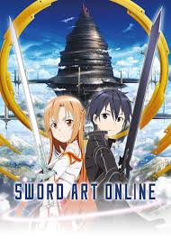

---

title: Anime and gaming

description: "Anime and gaming have always had a strong connection, with many anime series drawing inspiration from video games and vice versa. "

date: May 20 2023

---

1. *Sword Art Online* 

    Take a virtual reality journey into the fantasy MMORPG "Sword Art Online" environment where players are imprisoned. This anime series examines the virtual gaming experience unlike any other with breathtaking visuals, thrilling combat, and an engaging plot.

2. *Haikyuu!!*

    While not directly focused on gaming, "Haikyuu!!" captures the competitive spirit and teamwork essential to both gaming and sports. Follow Shoyo Hinata, a young volleyball enthusiast, as he aspires to become a formidable player and lead his team to victory

3. *Attack On Titan* 

    Despite not being specifically about gaming, "Attack on Titan" enthrals gamers with its gripping action sequences, intricate characters, and realistic world-building. Join Eren Yeager and his allies as they engage in combat with enormous humanoids known as Titans in a post-apocalyptic setting.

    

 **Conclusion:**

These 3 anime series offer a diverse range of genres and themes that cater to the interests of gamers. Whether you're a fan of virtual reality adventures, strategic battles, or captivating storytelling, these anime series are bound to provide hours of entertainment and resonate with your gaming spirit. So grab some snacks, sit back, and immerse yourself in these must-watch anime series that will undoubtedly leave a lasting impression on any gamer.
